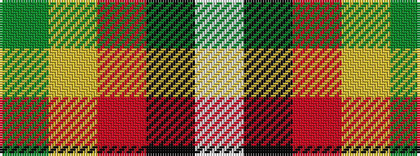

GYRKW

It is a 5 stripe tartan.

<figure class="pat-woven">

<figcaption>idealised sample</figcaption>
</figure>

## Colour Sequence



## Tartans with this colour sequence

| Tartans |
|---------------|
| [Papua New Guinea](/setts/s5/g3ly5r14k36w3~x2/)|
||
| [Papua New Guinea Pipes and Drums](/setts/s5/g3ly5r13k33w2~x2/)|
||
