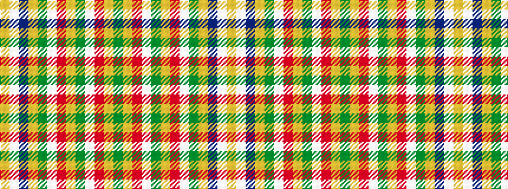

GYRWGYRWGYBWY

It is a 13 stripe tartan.

<figure class="pat-woven">

<figcaption>idealised sample</figcaption>
</figure>

## Colour Sequence



## Tartans with this colour sequence

| Tartans |
|---------------|
| [Morgan Jocelyn . . . (Personal)](/variants/s13/g40lo2r3lb2g4lo1r18lb1g2lo1b4lb1lo3~x2/)|
||
| [Morgan Jocelyn Osmélian Peregrine (Personal)](/variants/s13/g40lo2r3w2g4lo1r18w1g2lo1n4w1lo3~x2/)|
||
