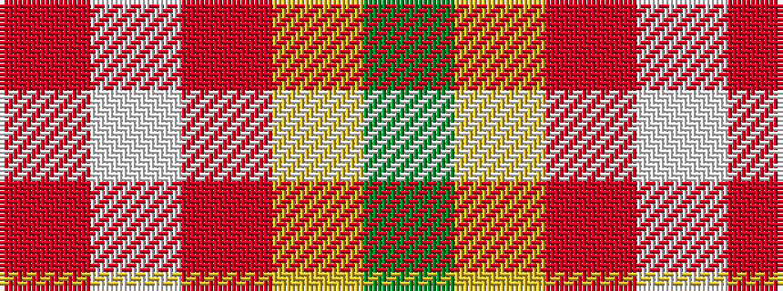

GYRWR

It is a 5 stripe tartan.

<figure class="pat-woven">

<figcaption>idealised sample</figcaption>
</figure>

## Colour Sequence



## Tartans with this colour sequence

| Tartans |
|---------------|
| [Highlands at Wyomissing, The](/variants/s5/r35w3r8ly2g11~x2/)|
||
