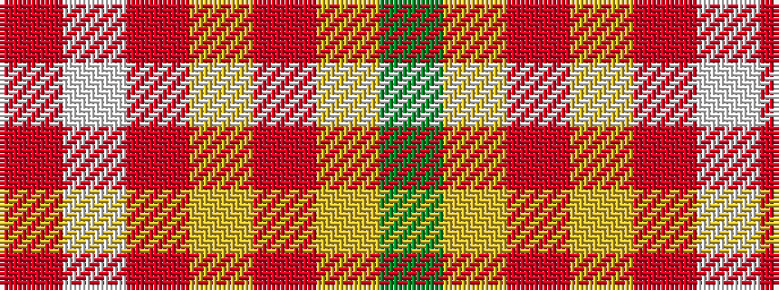

GYRYRWR

It is a 7 stripe tartan.

<figure class="pat-woven">

<figcaption>idealised sample</figcaption>
</figure>

## Colour Sequence



## Tartans with this colour sequence

| Tartans |
|---------------|
| [Golden Pheasant](/setts/s7/r12w4r3lo18r3ly4g2~x2/)|
||
