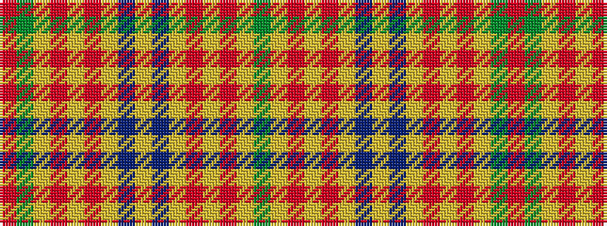

GYRYRYBYBYRYRYGR

It is a 16 stripe tartan.

<figure class="pat-woven">

<figcaption>idealised sample</figcaption>
</figure>

## Colour Sequence



## Tartans with this colour sequence

| Tartans |
|---------------|
| [Stevenson (Personal)](/variants/s16/g6ly1r2ly1r2ly1db6ly1db6ly1r2ly1r2ly1g6r1~x8/)|
||
