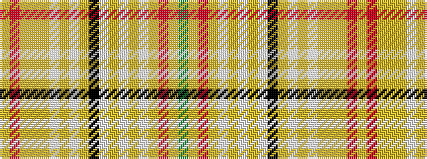

GYRYWYWYWKYWYWYYYRY

It is a 19 stripe tartan.

<figure class="pat-woven">

<figcaption>idealised sample</figcaption>
</figure>

## Colour Sequence



## Tartans with this colour sequence

| Tartans |
|---------------|
| [Tenon Tours](/setts/s19/g40lo3r12lo3w1lo1w1lo1w1k4lo1w1lo1w1lo1lo1lo3r12lo3~x2/)|
||
