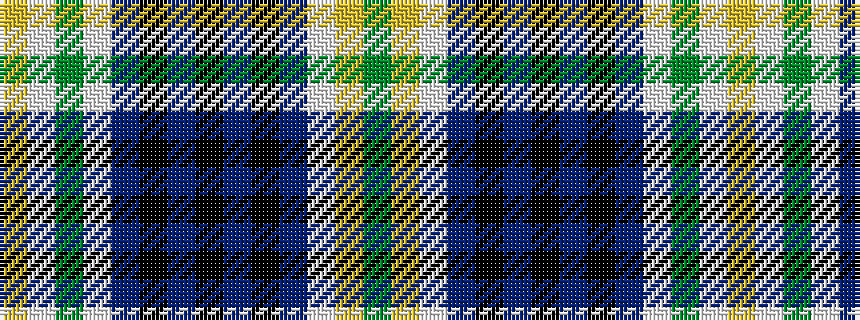

GYWBKBKBKBWGWY

It is a 14 stripe tartan.

<figure class="pat-woven">

<figcaption>idealised sample</figcaption>
</figure>

## Colour Sequence



## Tartans with this colour sequence

| Tartans |
|---------------|
| [Carstairs](/setts/s14/g5lo2w2db8k2db5k2db28k2db10w4g3w2lo4~x2/)|
||
