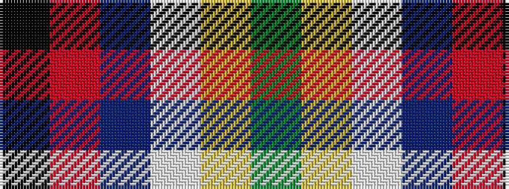

GYWBRK

It is a 6 stripe tartan.

<figure class="pat-woven">

<figcaption>idealised sample</figcaption>
</figure>

## Colour Sequence



## Tartans with this colour sequence

| Tartans |
|---------------|
| [Bro-sant-Malou](/setts/s6/k3r24dt16w11ly1g3~x2/)|
||
