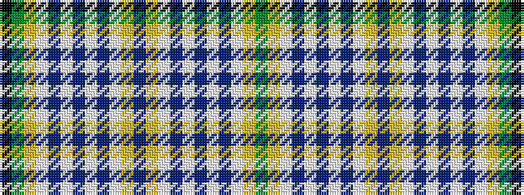

GYWBWBWBWYBYWBWBWBWYGK

It is a 22 stripe tartan.

<figure class="pat-woven">

<figcaption>idealised sample</figcaption>
</figure>

## Colour Sequence



## Tartans with this colour sequence

| Tartans |
|---------------|
| [Unidentified Lindley #3](/variants/s22/g3lo19w2db3w3db6w2db3w2ly4db14ly4w2db3w2db6w3db3w2lo19g3k2~x2/)|
||
