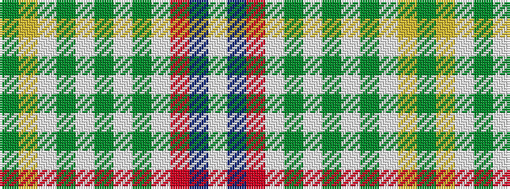

GYWGWGWGWRBW

It is a 12 stripe tartan.

<figure class="pat-woven">

<figcaption>idealised sample</figcaption>
</figure>

## Colour Sequence



## Tartans with this colour sequence

| Tartans |
|---------------|
| [Dunblane](/tartans/dg6ly5w1dg2w1dg5w1dg2w1r15dp2w1/)|
||
| [Dunblane](/setts/s12/g6ly5w1g2w1g5w1g2w1r15db2w1~x2/)|
||
