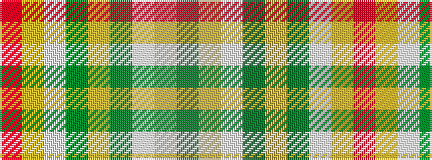

GYWGYGWYR

It is a 9 stripe tartan.

<figure class="pat-woven">

<figcaption>idealised sample</figcaption>
</figure>

## Colour Sequence



## Tartans with this colour sequence

| Tartans |
|---------------|
| [Toorak Chapler (Fashion)](/setts/s9/dy3lo1lb1dy1lo1dy3lb3ly6r1~x6/)|
||
