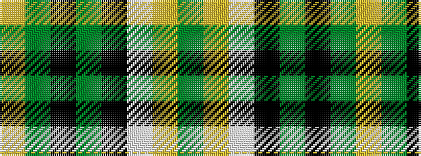

GYWKGKGY

It is a 8 stripe tartan.

<figure class="pat-woven">

<figcaption>idealised sample</figcaption>
</figure>

## Colour Sequence



## Tartans with this colour sequence

| Tartans |
|---------------|
| [Celtic Pride](/setts/s8/g10lo3w2k2g8k22g43lo4~x2/)|
||
