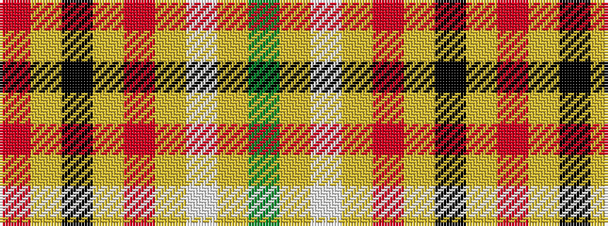

GYWYRYKYR

It is a 9 stripe tartan.

<figure class="pat-woven">

<figcaption>idealised sample</figcaption>
</figure>

## Colour Sequence



## Tartans with this colour sequence

| Tartans |
|---------------|
| [Cawte of Middlebanknock (Personal)](/setts/s9/g13ly16w4ly4r4ly4k20ly8r8~x2/)|
||
