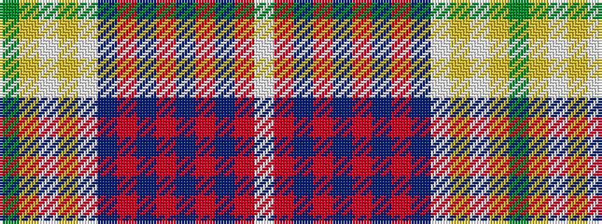

GYWYWBRBRBRBRW

It is a 14 stripe tartan.

<figure class="pat-woven">

<figcaption>idealised sample</figcaption>
</figure>

## Colour Sequence



## Tartans with this colour sequence

| Tartans |
|---------------|
| [Mighty Men (Corporate)](/setts/s14/g20lr1lb2lr1lb2db4r1db1r1db1r1db1r2w2~x4/)|
||
