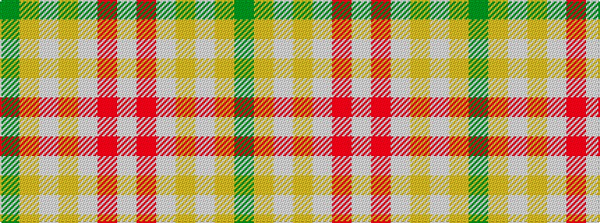

GYWYWRW

It is a 7 stripe tartan.

<figure class="pat-woven">

<figcaption>idealised sample</figcaption>
</figure>

## Colour Sequence



## Tartans with this colour sequence

| Tartans |
|---------------|
| [Whisky Kilt (Fashion)](/variants/s7/w168r2w2lo2w2loi3g26~x2/)|
||
