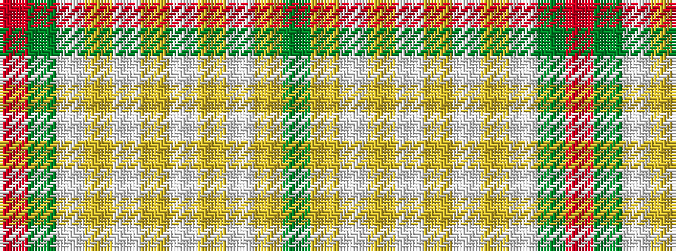

GYWYWYWYWGR

It is a 11 stripe tartan.

<figure class="pat-woven">

<figcaption>idealised sample</figcaption>
</figure>

## Colour Sequence



## Tartans with this colour sequence

| Tartans |
|---------------|
| [McAleavy (2014)](/setts/s11/y56lr6wi6ly2w2ly2w16lr10w2y6r3~x2/)|
||
