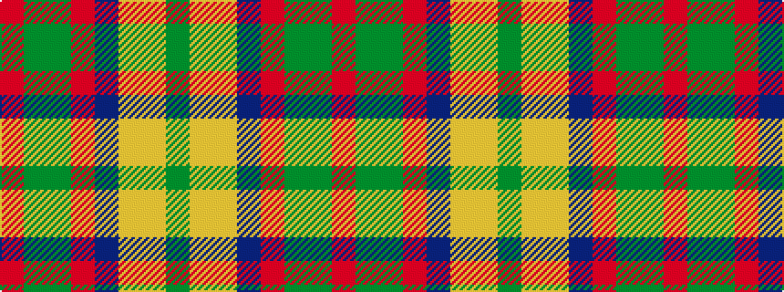

GYYBRGGR

It is a 8 stripe tartan.

<figure class="pat-woven">

<figcaption>idealised sample</figcaption>
</figure>

## Colour Sequence



## Tartans with this colour sequence

| Tartans |
|---------------|
| [Tartan Army Whisky](/variants/s8/r26g5dg7ri2do9loi1lo1dg4~x2/)|
||
| [Tartan Army Whisky](/variants/s8/r26g5dg7ri2do9lo1loi1dg4~x2/)|
||
