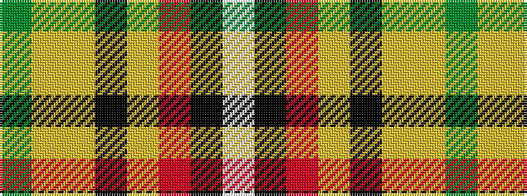

GYYKYRKW

It is a 8 stripe tartan.

<figure class="pat-woven">

<figcaption>idealised sample</figcaption>
</figure>

## Colour Sequence



## Tartans with this colour sequence

| Tartans |
|---------------|
| [Cornish Christophers (Personal)](/setts/s8/g5lg5ly26k4ly6r5k15w4~x2/)|
||
