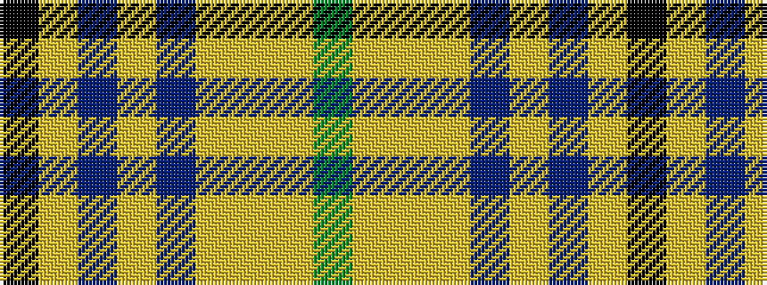

GYYYBYBYK

It is a 9 stripe tartan.

<figure class="pat-woven">

<figcaption>idealised sample</figcaption>
</figure>

## Colour Sequence



## Tartans with this colour sequence

| Tartans |
|---------------|
| [Cotswolds Distillery](/setts/s9/k4ly12n3ly3n3ly4lr17ly15dy4~x2/)|
||
