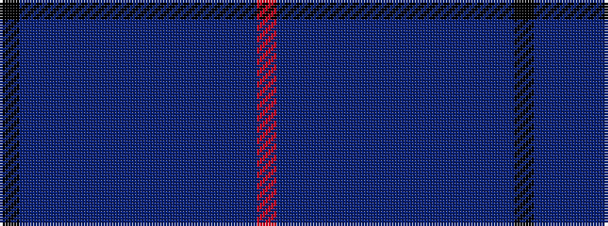

KBBBBBBBBBBBBR

It is a 14 stripe tartan.

<figure class="pat-woven">

<figcaption>idealised sample</figcaption>
</figure>

## Colour Sequence



## Tartans with this colour sequence

| Tartans |
|---------------|
| [Benedictus Blue (Personal)](/variants/s14/k16t6db12dt4dp4dt4db35dt40db4dt4db4dt6dp4m6/)|
||
