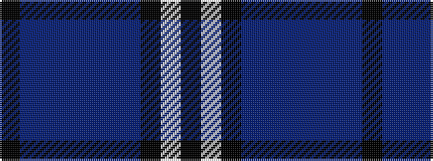

KBBBBBBKWK

It is a 10 stripe tartan.

<figure class="pat-woven">

<figcaption>idealised sample</figcaption>
</figure>

## Colour Sequence



## Tartans with this colour sequence

| Tartans |
|---------------|
| [Nunavut (District)](/setts/s10/k6t2n2t3n2t2n30k20w6k4~x2/)|
||
