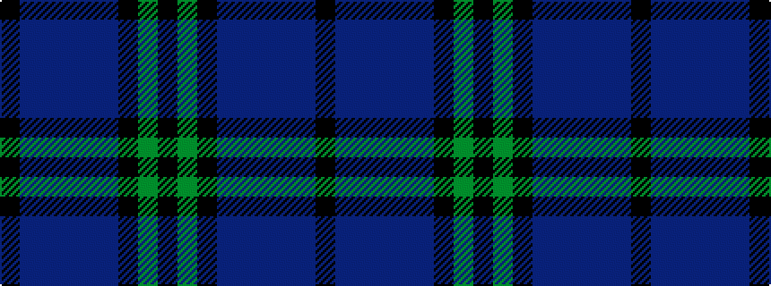

KBBBBBKGK

It is a 9 stripe tartan.

<figure class="pat-woven">

<figcaption>idealised sample</figcaption>
</figure>

## Colour Sequence



## Tartans with this colour sequence

| Tartans |
|---------------|
| [Laird (Name)](/variants/s9/k53g5k5dp13db5dp5db5dp5k5~x2/)|
||
| [Laird (Restricted)](/variants/s9/k75g2k4dp10db1dp4db1dp4k4~x2/)|
||
