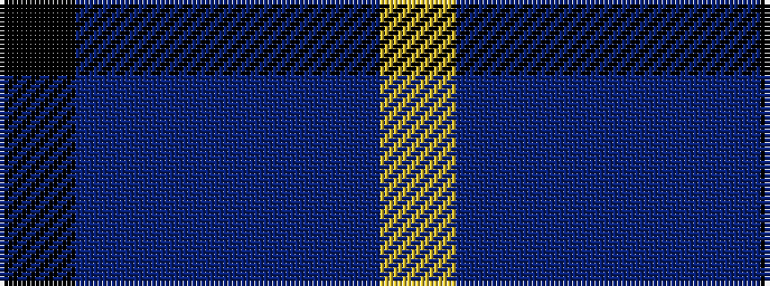

KBBBBY

It is a 6 stripe tartan.

<figure class="pat-woven">

<figcaption>idealised sample</figcaption>
</figure>

## Colour Sequence



## Tartans with this colour sequence

| Tartans |
|---------------|
| [Murdoch (Geoffrey)](/setts/s6/k2dr1dt17dr17db1ly2~x4/)|
||
