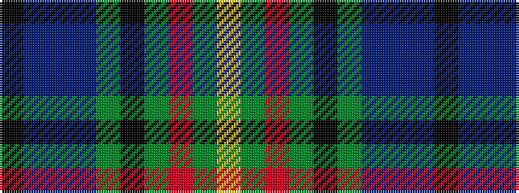

KBBBGKGRGY

It is a 10 stripe tartan.

<figure class="pat-woven">

<figcaption>idealised sample</figcaption>
</figure>

## Colour Sequence



## Tartans with this colour sequence

| Tartans |
|---------------|
| [Schmidt (2014)](/setts/s10/k3db20db8db4dg20k2dg2r2dg3lo3~x2/)|
||
| [Schmidt (2014)](/setts/s10/k3db20db8db4g20k2g2r2g3ly3~x2/)|
||
