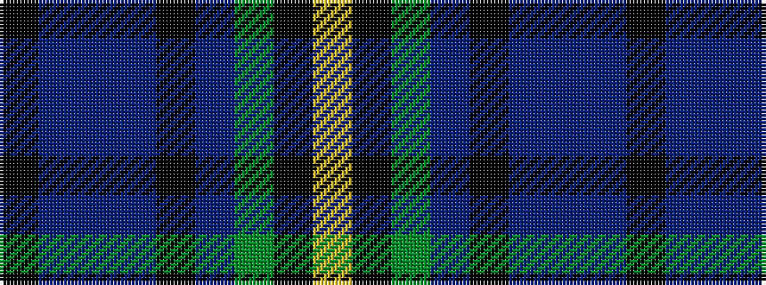

KBBBKBGKY

It is a 9 stripe tartan.

<figure class="pat-woven">

<figcaption>idealised sample</figcaption>
</figure>

## Colour Sequence



## Tartans with this colour sequence

| Tartans |
|---------------|
| [Ayrshire Tourist Board](/setts/s9/k10p3db4p3k7b3g8k17ly2~x2/)|
||
