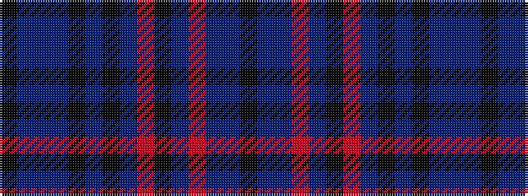

KBBBKBKBRKBRBBK

It is a 15 stripe tartan.

<figure class="pat-woven">

<figcaption>idealised sample</figcaption>
</figure>

## Colour Sequence



## Tartans with this colour sequence

| Tartans |
|---------------|
| [GOLF (Corporate)](/setts/s15/k15dp2dt1r1t1k15r1dt2k15t1k15dp4dt2t1k15~x2/)|
||
