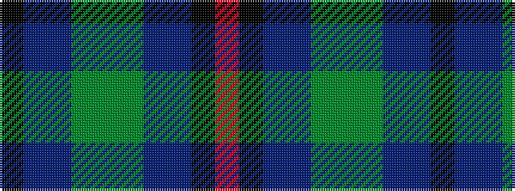

KBBGGGBBKR

It is a 10 stripe tartan.

<figure class="pat-woven">

<figcaption>idealised sample</figcaption>
</figure>

## Colour Sequence



## Tartans with this colour sequence

| Tartans |
|---------------|
| [Haughfoot](/setts/s10/k15t4dt15dg24y4dg24dt15t4k15r4~x2/)|
||
