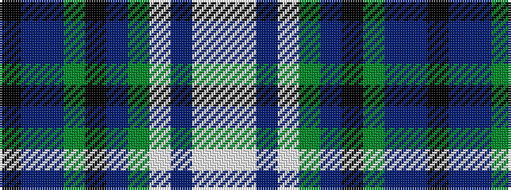

KBBGKBGWBWW

It is a 11 stripe tartan.

<figure class="pat-woven">

<figcaption>idealised sample</figcaption>
</figure>

## Colour Sequence



## Tartans with this colour sequence

| Tartans |
|---------------|
| [Manderson (Personal)](/variants/s11/k8n22n8dg16k24dr8dg32lbi32dr7lbi12lb4/)|
||
