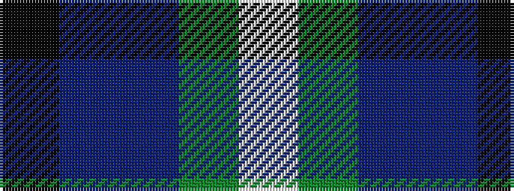

KBBGW

It is a 5 stripe tartan.

<figure class="pat-woven">

<figcaption>idealised sample</figcaption>
</figure>

## Colour Sequence



## Tartans with this colour sequence

| Tartans |
|---------------|
| [Wellington No 229](/setts/s5/k4t3dp11dg14w2~x2/)|
||
| [Wellington, No 229](/setts/s5/k4t3p11g14w2~x2/)|
||
