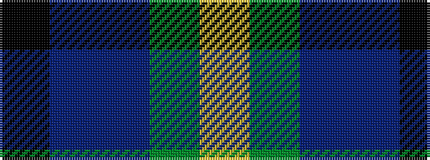

KBBGY

It is a 5 stripe tartan.

<figure class="pat-woven">

<figcaption>idealised sample</figcaption>
</figure>

## Colour Sequence



## Tartans with this colour sequence

| Tartans |
|---------------|
| [Gala Water Old](/variants/s5/k19t10dp19dg40ly10/)|
||
| [Gallowater Old District Tartan](/variants/s5/k19t10dp19g40ly10/)|
||
| [Gallowater, Old](/variants/s5/k19t10p19g40ly10/)|
||
| [Wellington, No 122](/variants/s5/k4t3p11g14ly2~x2/)|
||
