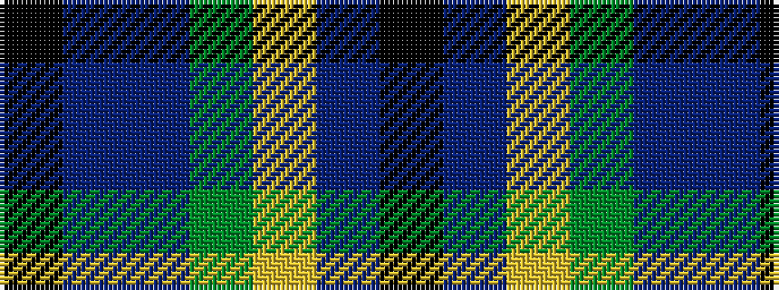

KBBGYBK

It is a 7 stripe tartan.

<figure class="pat-woven">

<figcaption>idealised sample</figcaption>
</figure>

## Colour Sequence



## Tartans with this colour sequence

| Tartans |
|---------------|
| [Black Raven (Fashion)](/setts/s7/k62db15b15dy20ly5db5k15~x2/)|
||
