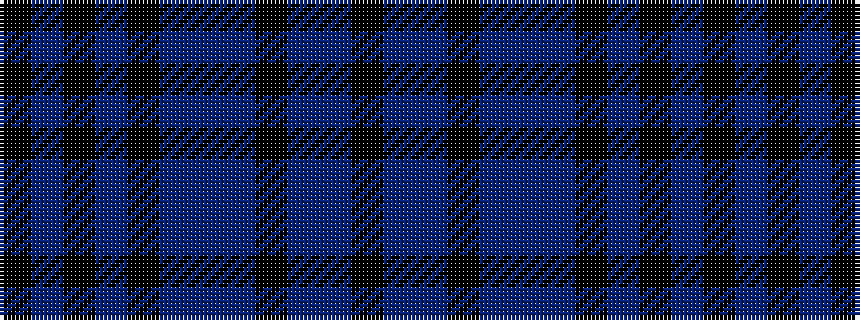

KBBKBBBKBKBK

It is a 12 stripe tartan.

<figure class="pat-woven">

<figcaption>idealised sample</figcaption>
</figure>

## Colour Sequence



## Tartans with this colour sequence

| Tartans |
|---------------|
| [Hopkins (Welsh Name)](/setts/s12/k5db2k2db2k2dt5db2dt1k1dt1db10k3~x4/)|
||
