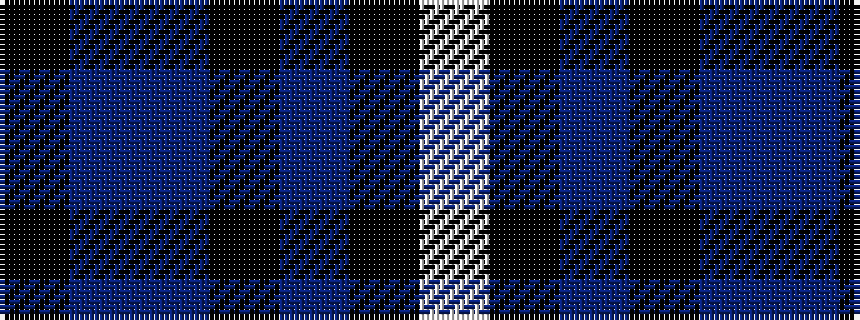

KBBKBKW

It is a 7 stripe tartan.

<figure class="pat-woven">

<figcaption>idealised sample</figcaption>
</figure>

## Colour Sequence



## Tartans with this colour sequence

| Tartans |
|---------------|
| [Mary Washington](/setts/s7/k1db6b1k6b6k1w1~x6/)|
||
