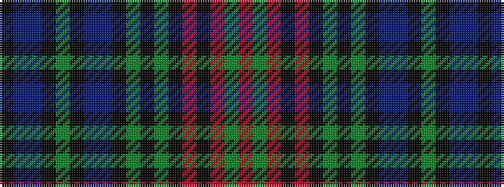

KBBKGKBBKGKGKRKRGR

It is a 18 stripe tartan.

<figure class="pat-woven">

<figcaption>idealised sample</figcaption>
</figure>

## Colour Sequence



## Tartans with this colour sequence

| Tartans |
|---------------|
| [Renton (Personal)](/variants/s18/o8dy2o8k4r3k4dy8k2dy8k4dt21n8k2dy3k2n8dt24k3~x2/)|
||
