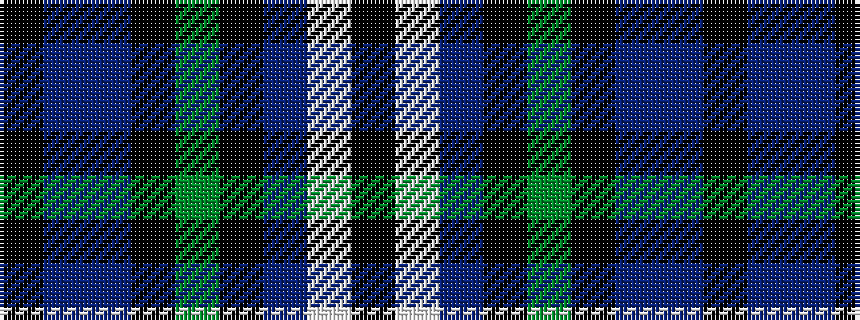

KBBKGKBWK

It is a 9 stripe tartan.

<figure class="pat-woven">

<figcaption>idealised sample</figcaption>
</figure>

## Colour Sequence



## Tartans with this colour sequence

| Tartans |
|---------------|
| [South Lanarkshire (2002) (District)](/variants/s9/k2w1dp7k1g6k1db7t1k1~x4/)|
||
