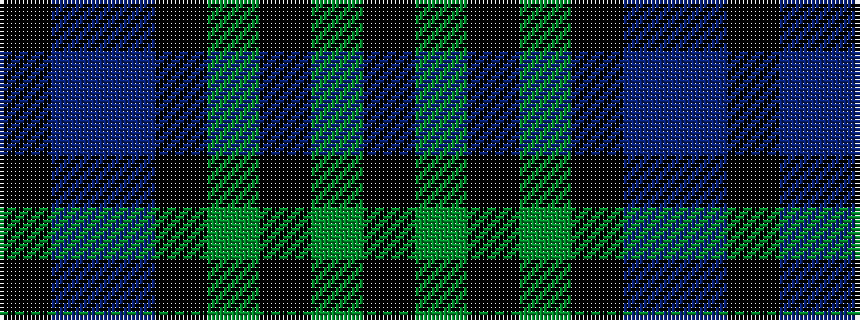

KBBKGKGK

It is a 8 stripe tartan.

<figure class="pat-woven">

<figcaption>idealised sample</figcaption>
</figure>

## Colour Sequence



## Tartans with this colour sequence

| Tartans |
|---------------|
| [Wilson's No 108](/variants/s8/k7dg7k1dg7k7t1dp7k1~x4/)|
||
| [Wilson's, No 108](/variants/s8/k7g7k1g7k7t1p7k1~x4/)|
||
