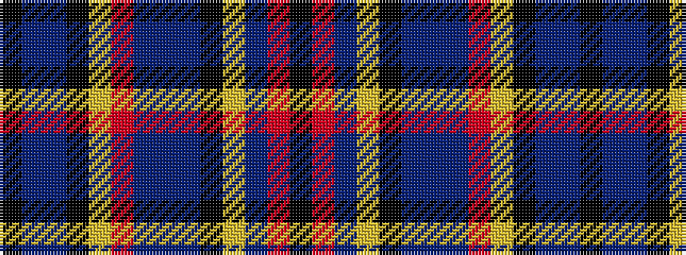

KBBKYRBBBKYBRK

It is a 14 stripe tartan.

<figure class="pat-woven">

<figcaption>idealised sample</figcaption>
</figure>

## Colour Sequence



## Tartans with this colour sequence

| Tartans |
|---------------|
| [Parker Black (2009)](/variants/s14/k30r3db10ly3k40t5n5db8r3ly5k25db8t8k5/)|
||
