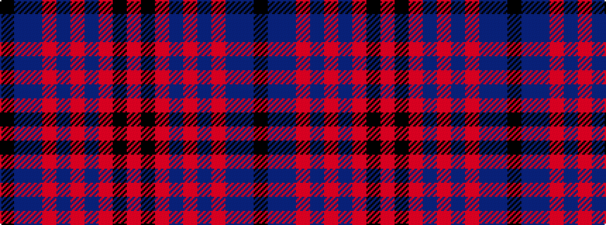

KBBRBRBRKR

It is a 10 stripe tartan.

<figure class="pat-woven">

<figcaption>idealised sample</figcaption>
</figure>

## Colour Sequence



## Tartans with this colour sequence

| Tartans |
|---------------|
| [Ryukoku University Heian JHS (Corp)](/variants/s10/m4k16o5n8o2dp2o2dp2n8k3~x2/)|
||
