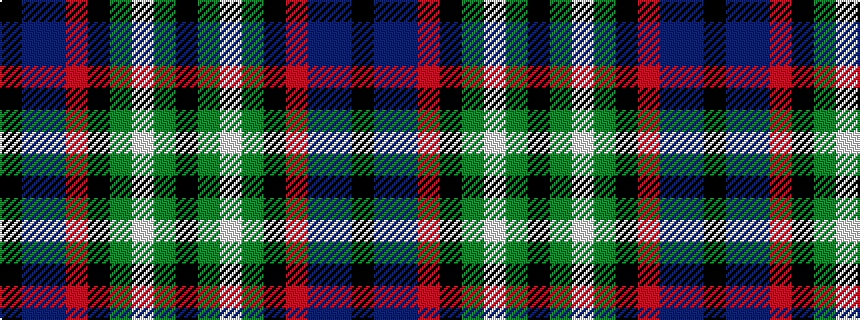

KBBRKGWGK

It is a 9 stripe tartan.

<figure class="pat-woven">

<figcaption>idealised sample</figcaption>
</figure>

## Colour Sequence



## Tartans with this colour sequence

| Tartans |
|---------------|
| [Hunter Graham](/variants/s9/k10dg9w2dg9k10r1db8dp12k3~x2/)|
||
