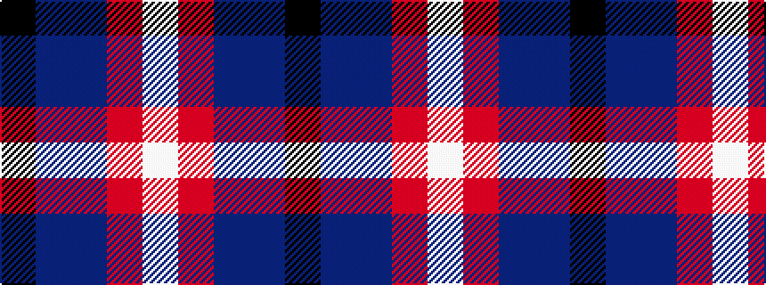

KBBRW

It is a 5 stripe tartan.

<figure class="pat-woven">

<figcaption>idealised sample</figcaption>
</figure>

## Colour Sequence



## Tartans with this colour sequence

| Tartans |
|---------------|
| [Fettes (Personal)](/variants/s5/k50db3p2r3w1~x4/)|
||
| [Kinloch of Loch Awe (Personal)](/variants/s5/w18o29t2dp3k1~x2/)|
||
