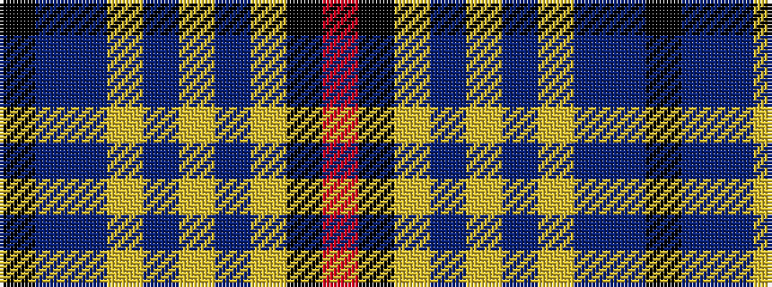

KBBYBYBYKR

It is a 10 stripe tartan.

<figure class="pat-woven">

<figcaption>idealised sample</figcaption>
</figure>

## Colour Sequence



## Tartans with this colour sequence

| Tartans |
|---------------|
| [Ryukoku University Heian Junior Corporate Tartan](/variants/s10/m5k15lr5n9lr2dp2lr2dp2n9k3~x2/)|
||
