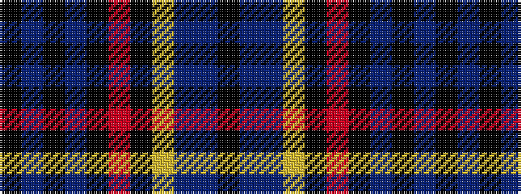

KBBYKRKBKBK

It is a 11 stripe tartan.

<figure class="pat-woven">

<figcaption>idealised sample</figcaption>
</figure>

## Colour Sequence



## Tartans with this colour sequence

| Tartans |
|---------------|
| [Moggach (Strathspey)](/variants/s11/k4n4k4n18k9r2k9lg1n18t2k3~x2/)|
||
