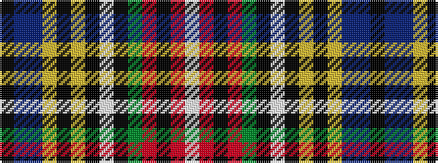

KBBYKYKWKGRKRW

It is a 14 stripe tartan.

<figure class="pat-woven">

<figcaption>idealised sample</figcaption>
</figure>

## Colour Sequence



## Tartans with this colour sequence

| Tartans |
|---------------|
| [Beatty](/setts/s14/k6b3db28lo8k10lo2k2lb2k4g16r12k2r6lb2~x2/)|
||
