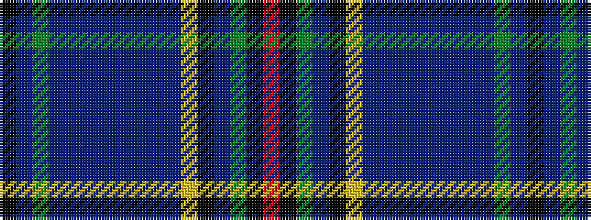

KBGBBBBBBBBYKBGKR

It is a 17 stripe tartan.

<figure class="pat-woven">

<figcaption>idealised sample</figcaption>
</figure>

## Colour Sequence



## Tartans with this colour sequence

| Tartans |
|---------------|
| [St. Lawrence](/variants/s17/k3db2g2db26b1db1b1db1b1db1b3lg2k10db3g14k3r3~x2/)|
||
