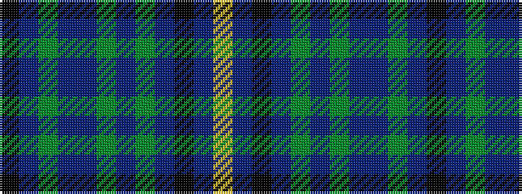

KBGBBGBGBKBY

It is a 12 stripe tartan.

<figure class="pat-woven">

<figcaption>idealised sample</figcaption>
</figure>

## Colour Sequence



## Tartans with this colour sequence

| Tartans |
|---------------|
| [Harris, Jeffrey S (Personal)](/variants/s12/k3db2dg2db22dr4dg3dr3dg2dr22k2dr2ly2~x2/)|
||
