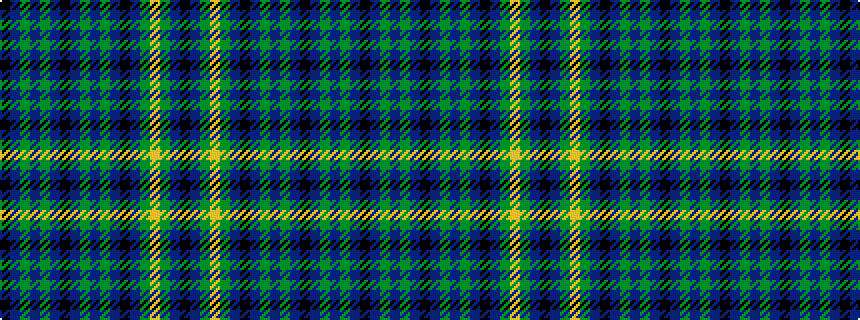

KBGBGBKBGBGBKBGYGBK

It is a 19 stripe tartan.

<figure class="pat-woven">

<figcaption>idealised sample</figcaption>
</figure>

## Colour Sequence



## Tartans with this colour sequence

| Tartans |
|---------------|
| [Offally Irish County Tartan](/variants/s19/k19db2g10ly3g10db2k24db2g10db18g5db2ki7db2g5db18g10db2k5~x2/)|
||
