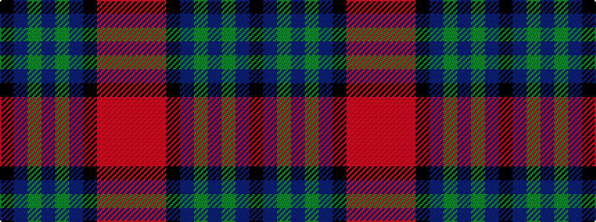

KBGBGBKRRR

It is a 10 stripe tartan.

<figure class="pat-woven">

<figcaption>idealised sample</figcaption>
</figure>

## Colour Sequence



## Tartans with this colour sequence

| Tartans |
|---------------|
| [Murdoch (Dalgliesh)](/variants/s10/k5do1g3do1g3do1k5r1ri5r1~x4/)|
||
