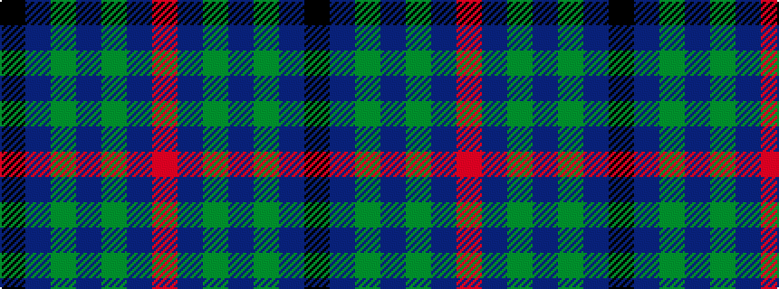

KBGBGBR

It is a 7 stripe tartan.

<figure class="pat-woven">

<figcaption>idealised sample</figcaption>
</figure>

## Colour Sequence



## Tartans with this colour sequence

| Tartans |
|---------------|
| [Kinding](/variants/s7/k10db30g3db3g3db3r6~x2/)|
||
| [Kinding (Personal)](/variants/s7/k10t30g3t3g3t3r6~x2/)|
||
