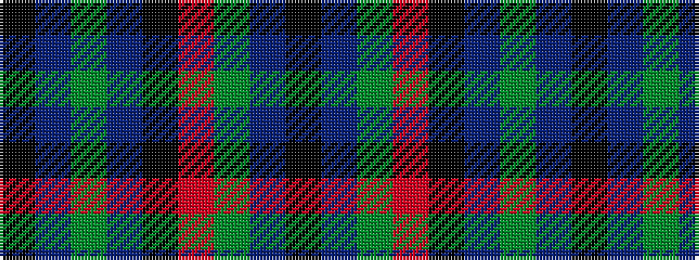

KBGBKRGBK

It is a 9 stripe tartan.

<figure class="pat-woven">

<figcaption>idealised sample</figcaption>
</figure>

## Colour Sequence



## Tartans with this colour sequence

| Tartans |
|---------------|
| [MacNett](/setts/s9/k1db1g16r16k12db8g16db1k1~x2/)|
||
