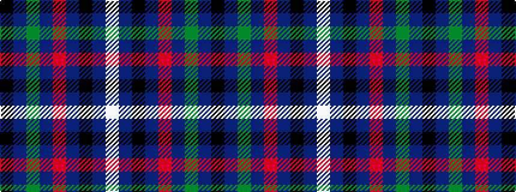

KBGBRBKBW

It is a 9 stripe tartan.

<figure class="pat-woven">

<figcaption>idealised sample</figcaption>
</figure>

## Colour Sequence



## Tartans with this colour sequence

| Tartans |
|---------------|
| [Crieff Highland Gathering](/variants/s9/k3dp16dg5dp3m2dp2k12db23w2~x2/)|
||
